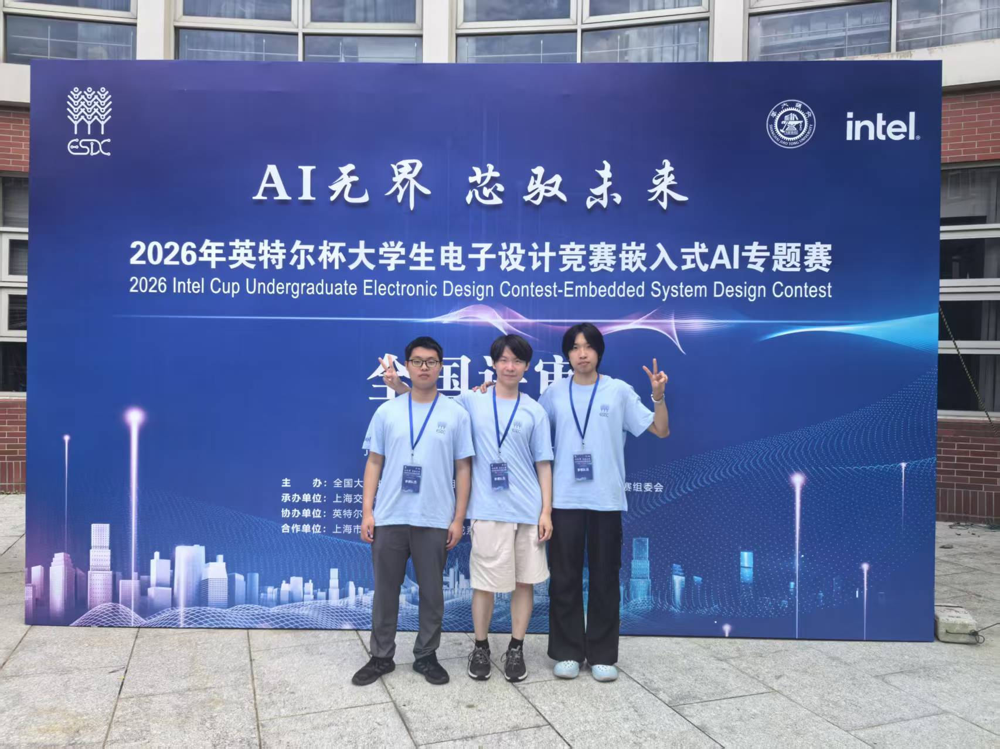
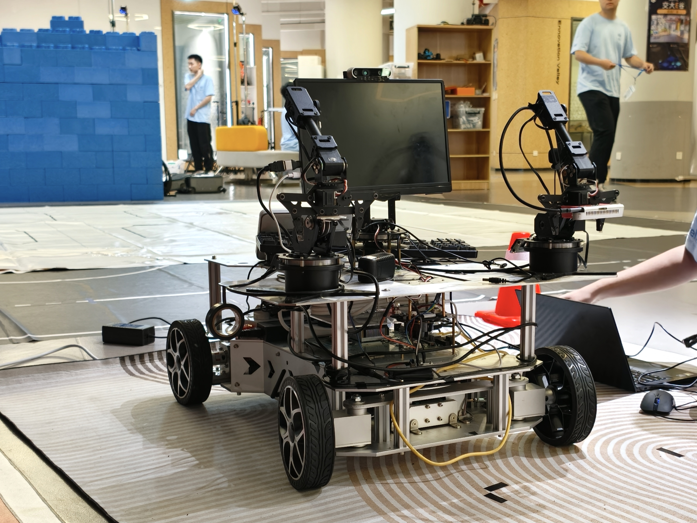

# LingXi-MultiModal-DualArm-MobileBot
Multi-modal perception & mobile manipulation system for dual-arm autonomous robot.

## Overview
This project implements a multi-modal perception and motion control framework for a dual-arm mobile robot platform. It integrates visual perception, natural language understanding, environment modeling, and end-to-end robot control to achieve autonomous mobile manipulation tasks.

## 🔥🔥🔥 News
- **【2026.07】**  我们的项目在英特尔杯全国大学生电子设计竞赛嵌入式AI专题赛中荣获全国二等奖！感谢队友胡天崴和范恩齐的出色合作！

- **【2026.04】**  我们的项目在大创结题答辩时获得了国家级良好的项目成果！感谢项目组成员的努力！
- **【2025.07】**  我们的项目在第九届全国大学生集成电路创新创业大赛 东北分赛区决赛二等奖，感谢队友们的初步系统搭建！我们的机器人可以实现简单的移动避障、对话抓取等操作了！！！

## Features
- Multi-modal input: RGB camera, depth sensing, audio / command understanding
·

- Dual-arm cooperative motion planning and trajectory generation

- Mobile base autonomous navigation and obstacle avoidance

- Real-time environment perception and target localization
- Modular software architecture for easy deployment and extension

## System Architecture
1. **Perception Module**: Object detection, semantic segmentation, pose estimation
2. **Decision & Planning Module**: Task parsing, motion planning, collision checking
3. **Control Module**: Low-level robot arm & mobile base control
4. **Fusion Module**: Multi-modal information alignment and state estimation

